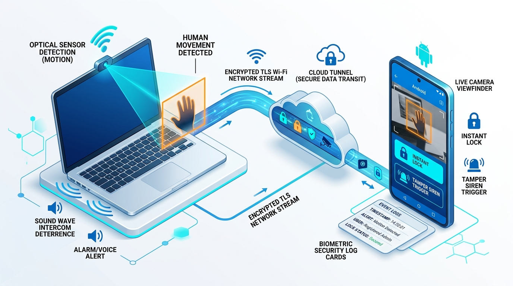

<div align="center">

# 🛡️ Laptop Sentinel & Security Monitor

**Remote Anti-Theft Surveillance, Optical Intruder Detection & Instant Workstation Defense**

[-3DDC84?style=for-the-badge&logo=android&logoColor=white)](https://developer.android.com)
[](https://developer.android.com/jetpack/compose)
[](https://kotlinlang.org)
[](https://opencv.org)
[](LICENSE)

<br/>


<br/>

> **Never worry about leaving your laptop unattended again.**  
> Turn any laptop webcam into a smart anti-theft security camera with real-time motion detection, live streaming, voice warnings, acoustic sirens, and one-tap remote locking from your Android phone.

</div>

---

## 📖 Table of Contents

1. [Executive Overview (Non-Technical)](#-executive-overview-non-technical)
2. [Technical Architecture Deep-Dive](#-technical-architecture-deep-dive)
3. [Key Capabilities & Features](#-key-capabilities--features)
4. [Hardware & Network Flow](#-hardware--network-flow)
5. [Quickstart & Installation](#-quickstart--installation)
   - [Laptop Companion Setup (Windows / macOS / Linux)](#1-laptop-companion-setup)
   - [Android Application Setup](#2-android-application-setup)
6. [Lid-Closed & Sleep Prevention Guide](#-lid-closed--sleep-prevention-guide)
7. [REST API Specification](#-rest-api-specification)
8. [Security & Privacy Model](#-security--privacy-model)
9. [Project Directory Structure](#-project-directory-structure)
10. [License & Credits](#-license--credits)

---

## 🌟 Executive Overview (Non-Technical)

### The Problem
You are working at a busy coffee shop, studying in a university library, or working in an open-plan office. You need to use the restroom, grab another coffee, or talk to a colleague for just three minutes. Packing up your laptop, charger, and accessories is tedious—yet leaving hundreds or thousands of dollars of hardware and sensitive personal data unattended on a table is nerve-wracking.

### The Solution: Laptop Sentinel
**Laptop Sentinel** bridges your laptop and your Android smartphone into an active security perimeter:

* **👀 Continuous Optical Vigilance**: While you're away, the laptop webcam quietly monitors its surroundings. If anyone walks up to your desk or reaches for your laptop, your phone vibrates immediately with a high-priority intruder alert.
* **📸 Automatic Photographic Evidence**: The moment an intruder enters the laptop's view, a high-resolution snapshot is captured, transmitted, and logged into your phone's forensic vault.
* **🔒 Instant Remote Screen Locking**: Did you forget to lock your workstation before stepping away? Tap the **"Lock Screen"** button on your phone—or directly from your phone's lock screen notification shade—to instantly secure the operating system.
* **🗣️ Two-Way Audio Intercom & Voice Deterrence**: Speak directly through your phone's microphone to broadcast your voice out of the laptop speakers, or dispatch pre-recorded deterrent voice alerts (*"Security Alert: Step away from this computer immediately"*).
* **🚨 Acoustic Alarm Siren**: Sound an ear-splitting deterrent siren on the laptop's hardware speakers to alert everyone in the cafe or library that someone is tampering with your device.
* **🔋 Works with the Lid Closed**: Includes automated power policies and scripts that allow your laptop to remain actively guarding and detecting movement even with the laptop lid closed.

---

## 🏛️ Technical Architecture Deep-Dive

<div align="center">
  
</div>

The system consists of two primary components operating over an encrypted communication channel:

### 1. Android Client (Kotlin / Jetpack Compose)
* **Architecture Pattern**: Unidirectional Data Flow (UDF) with Clean Architecture and MVVM (`LaptopMonitorViewModel`).
* **UI Framework**: 100% Jetpack Compose using Material Design 3 (M3) components, custom radar scan canvases, and responsive window adaptations.
* **Background Surveillance Engine (`LaptopMonitorService`)**:
  * Persistent Android `foregroundServiceType="dataSync"` sticky service.
  * Partial `WakeLock` management for low-power background vigilance when the device display is asleep.
  * System notification shade integration with direct lock screen quick actions (`ACTION_LOCK_NOW`, `ACTION_TRIGGER_SIREN`).
* **Local Persistence (Room Database)**:
  * Embedded SQLite database via Room (`IntruderLogDao`, `LaptopDao`).
  * Structured storage of security breaches, timestamps, photo snapshots, connection latencies, and severity categorizations (`INFO`, `WARNING`, `ALERT`).
  * Export utilities generating forensic CSV spreadsheets and formatted text audit logs for security reviews.
* **Network & Security Layer (`LaptopApiClient`)**:
  * Asynchronous HTTP/REST client using OkHttp 4 with automated retry logic, keep-alive connection pooling, and exponential backoff.
  * Custom resilient SSL/TLS socket factory with X.509 validation for secure remote tunneling (Cloudflare Tunnels, Ngrok, Tailscale).
  * Strict Android Network Security Configuration (`network_security_config.xml`) enforcing encrypted TLS for public hosts while permitting zero-config private subnets.

### 2. Laptop Companion Daemon (`laptop_guard.py`)
* **Core Engine**: Light-weight, zero-cloud Python daemon leveraging OpenCV (`cv2`) and Flask.
* **Computer Vision Motion Algorithm**:
  * Frame differencing with Gaussian blur filtering (`cv2.GaussianBlur`) to eliminate ambient sensor noise.
  * Dilated threshold computation (`cv2.threshold`, `cv2.dilate`) to pinpoint kinetic movement vectors.
  * Dynamic sensitivity calibration: Standard Mode (5% frame delta) vs. Away Mode / Radar (2% high-vigilance delta).
  * Real-time contour bounding-box tracking and automatic snapshot extraction.
* **Adaptive Video Streaming**:
  * In-memory frame resizing and variable JPEG compression quality parameters (`?quality=75&scale=0.75`).
  * Multi-preset support: **ECO (360p)**, **BALANCED (540p)**, and **ULTRA (720p/1080p native)**.
* **Cross-Platform Workstation Control**:
  * **Windows**: `rundll32.exe user32.dll,LockWorkStation`
  * **macOS**: `pmset displaysleepnow` / `/System/Library/CoreServices/Menu Extras/User.menu/...`
  * **Linux (GNOME / KDE / X11 / Wayland)**: `loginctl lock-session` or `xdg-screensaver lock`
* **Audio & Deterrence Pipeline**:
  * Native hardware Text-to-Speech (TTS) synthesizer via SAPI5 (Windows), NSSpeechSynthesizer (macOS), or eSpeak (Linux).
  * Multi-frequency acoustic siren wave generator.
  * Full-duplex audio chunk streaming for live two-way walkie-talkie intercom.

---

## ⚡ Key Capabilities & Features

| Capability | Technical Implementation | Practical Benefit |
| :--- | :--- | :--- |
| **Live Webcam Viewfinder** | MJPEG & dynamic JPEG frame streaming with adjustable bitrate/quality. | Monitor your workstation table in real time with ultra-low latency. |
| **Smart Motion Radar** | Frame-by-frame OpenCV contour variance calculation. | Notifies you instantly when someone enters your laptop's field of view. |
| **Away Mode (High Vigilance)** | Lowers detection threshold to 2% and boosts polling rate. | Extra-sensitive surveillance when stepping away into another room or across the street. |
| **1-Tap Remote Lock** | OS API call executed in under 150ms over HTTP POST. | Secure your laptop instantly without touching it. |
| **Notification Shade Actions** | Android `PendingIntent` service broadcast triggers. | Lock your computer or sound the alarm directly from your phone's lock screen. |
| **Two-Way Voice Intercom** | PCM audio recording via `AudioRecord` / base64 streaming. | Speak to someone standing near your laptop in real time. |
| **Acoustic Deterrence Siren** | Sine-wave audio generator playing at maximum system volume. | Scares off opportunistic thieves and attracts public attention. |
| **Forensic Evidence Vault** | Local Room SQLite database with photo attachments. | Review time-stamped visual logs of everyone who approached your desk. |
| **Log Export (CSV / TXT)** | Android MediaStore & Scoped Storage document writer. | Export comprehensive security incident reports for campus safety or IT security. |
| **Lid-Closed Monitoring** | Windows `powercfg` / macOS `pmset` power policy overrides. | Keep the camera and daemon operating even with the laptop display closed. |
| **Full Simulation Demo Mode** | Built-in reactive mock hardware telemetry and synthetic video feed. | Test and explore all features immediately without configuring a laptop. |

---

## 🌐 Hardware & Network Flow

```
+-------------------------------------------------------------------------+
|                              LOCAL NETWORK                              |
|                                                                         |
|  [ Laptop Webcam ]                     [ Laptop Speakers ]              |
|          │                                      ▲                       |
|          ▼                                      │                       |
|  [ Python Daemon ] (laptop_guard.py) ───────────┴──────────┐            |
|    - OpenCV Motion Detection                               │            |
|    - OS Lock Controller                                    │            |
|    - HTTP REST Server (Port 5000)                          │            |
|          ▲                                                 │            |
+──────────┼─────────────────────────────────────────────────┼────────────+
           │                                                 │
           │  (Option A: Direct LAN Wi-Fi / IP)              │
           │  (Option B: Encrypted Cloudflare/Ngrok Tunnel)  │
           │                                                 │
+──────────┼─────────────────────────────────────────────────┼────────────+
|          ▼                                                 ▼            |
|  [ Android Phone ] (Laptop Sentinel Client)                             |
|    - Jetpack Compose Live Stream Dashboard                              |
|    - Background Vigilance Service (LaptopMonitorService)                |
|    - Room Database Forensic Incident Vault                              |
|    - Push & Heads-Up Notification Engine                                |
+-------------------------------------------------------------------------+
```

---

## 🚀 Quickstart & Installation

### 1. Laptop Companion Setup

You can run the companion server on **Windows**, **macOS**, or **Linux**.

#### Option A: One-Click Windows Installation
1. Open the Android app and navigate to the **Setup** tab.
2. Tap **"Share Companion Script"** or copy the script directly to your laptop.
3. Save as `install_guard.bat` and run it as Administrator.
4. The installer automatically configures dependencies, sets up the lid-close sleep prevention policy, and registers the server into Windows Startup.

#### Option B: Manual Setup (Windows / macOS / Linux)
1. Ensure Python 3.8+ is installed:
   ```bash
   python3 --version
   ```
2. Install required packages:
   ```bash
   pip install flask opencv-python pyttsx3 requests
   ```
3. Run the companion script:
   ```bash
   python laptop_guard.py --port 5000 --pin 1234
   ```
   *(The terminal will display your laptop's local IP address, e.g., `192.168.1.45:5000`)*

---

### 2. Android Application Setup

1. **Install the APK** onto your Android device (or run directly in Android Studio).
2. Launch **Laptop Sentinel**.
3. Open the **Setup** tab:
   * **Target IP / Host**: Enter your laptop's local IP (e.g. `192.168.1.45`) or your Cloudflare/Ngrok tunnel URL (`https://your-tunnel.trycloudflare.com`).
   * **Port**: `5000` (default).
   * **Security PIN**: Match the PIN configured on the laptop server (`1234`).
4. Tap **"Test Connection & Save"**.
5. Once connected, switch to the **Live Radar** tab to view your camera feed, arm motion detection, and test remote controls.

---

## 🔋 Lid-Closed & Sleep Prevention Guide

Laptops normally enter standby mode when the lid is closed. To ensure your laptop remains vigilant with the lid shut:

### 🪟 Windows
Run this command in an Administrator Command Prompt (or install via `install_guard.bat` which configures this automatically):
```cmd
powercfg /setacvalueindex SCHEME_CURRENT SUB_BUTTONS LIDACTION 0 && powercfg /setactive SCHEME_CURRENT
```
*(To restore default sleep on lid close later: replace `0` with `1`)*

### 🍎 macOS
Run in Terminal:
```bash
sudo pmset -a disablesleep 1
```
*(To restore default sleep: `sudo pmset -a disablesleep 0`)*

### 🐧 Linux (systemd)
Edit `/etc/systemd/logind.conf`:
```ini
HandleLidSwitch=ignore
HandleLidSwitchExternalPower=ignore
```
Then restart the service: `sudo systemctl restart systemd-logind`

---

## 📡 REST API Specification

The laptop companion server exposes a REST API authenticated via the `pin` parameter:

| Method | Endpoint | Description | Sample Query / Body |
| :--- | :--- | :--- | :--- |
| `GET` | `/api/status` | Heartbeat, lock state, and motion status | `?pin=1234` |
| `GET` | `/api/camera/frame` | Single JPEG frame with adaptive scaling | `?pin=1234&quality=75&scale=0.75` |
| `GET` | `/api/camera/stream` | Multipart/x-mixed-replace MJPEG stream | `?pin=1234` |
| `POST` | `/api/lock` | Instantly locks the workstation screen | `{"pin": "1234"}` |
| `POST` | `/api/alarm` | Fires high-decibel acoustic deterrent siren | `{"pin": "1234", "duration": 5}` |
| `POST` | `/api/speak` | Synthesizes spoken text via laptop speakers | `{"pin": "1234", "text": "Step away"}` |
| `POST` | `/api/intercom/audio`| Streams raw PCM audio to laptop speakers | `{"pin": "1234", "audio_data": "..."}` |
| `POST` | `/api/record/start` | Begins saving MP4 video of the subject | `{"pin": "1234"}` |
| `POST` | `/api/record/stop` | Stops video recording and saves output file | `{"pin": "1234"}` |
| `POST` | `/api/config/sensitivity` | Adjusts motion sensitivity threshold | `{"pin": "1234", "mode": "AWAY"}` |

---

## 🔒 Security & Privacy Model

* **Zero Cloud Dependency**: Video streams and photographic logs are routed directly between your laptop and your phone. No third-party servers, analytics platforms, or external cloud storage providers ever touch your video or audio feeds.
* **PIN Authentication**: All API endpoints require the matching security PIN. Unauthorized requests are immediately rejected with HTTP 401.
* **Scoped Storage & Play Policy Compliance**: Intruder snapshots and exported evidence logs are written using Android's modern Scoped Storage APIs without requiring broad legacy storage permissions.
* **Foreground Service Transparency**: The Android monitoring service runs transparently in the foreground with a persistent notification, ensuring Android OS resource managers never kill surveillance silently.

---

## 📁 Project Directory Structure

```
laptop-monitor/
├── app/
│   ├── src/main/
│   │   ├── AndroidManifest.xml              # Manifest, permissions & service declarations
│   │   ├── java/com/example/
│   │   │   ├── MainActivity.kt              # Navigation, dynamic theme & tab orchestration
│   │   │   ├── audio/                       # Audio recording & PCM stream utilities
│   │   │   ├── data/                        # Room Database, entities, DAOs & repository
│   │   │   ├── network/                     # OkHttp API client, TLS config & models
│   │   │   ├── service/                     # Persistent background surveillance service
│   │   │   ├── ui/
│   │   │   │   ├── components/              # Live radar canvas, cards & status chips
│   │   │   │   ├── screens/                 # Dashboard, Live Camera, Logs, Intercom, Setup
│   │   │   │   └── theme/                   # Material 3 Color Schemes & Typography
│   │   │   ├── util/                        # Companion script generator & notifications
│   │   │   └── viewmodel/                   # State management & reactive business logic
│   │   └── res/
│   │       ├── drawable/                    # Visual assets, vector icons & illustrations
│   │       └── xml/                         # Network security configuration (TLS/HTTP rules)
│   └── build.gradle.kts                     # App module Gradle configuration & dependencies
├── docs/
│   └── images/                              # Visual documentation assets & diagrams
│       ├── hero_banner.jpg                  # High-impact presentation banner
│       ├── arch_overview.jpg                # Isometric architecture diagram
│       └── app_icon.jpg                     # Application branding emblem
├── .env.example                             # Environment variable template
├── build.gradle.kts                         # Root Gradle build script
├── metadata.json                            # Platform metadata & project descriptor
└── README.md                                # Comprehensive repository documentation
```

---

## 📄 License & Credits

Distributed under the **MIT License**. See `LICENSE` for more information.

Designed and developed with modern Android Jetpack Compose, Kotlin Coroutines, OpenCV Computer Vision, and Material 3 Design principles.
